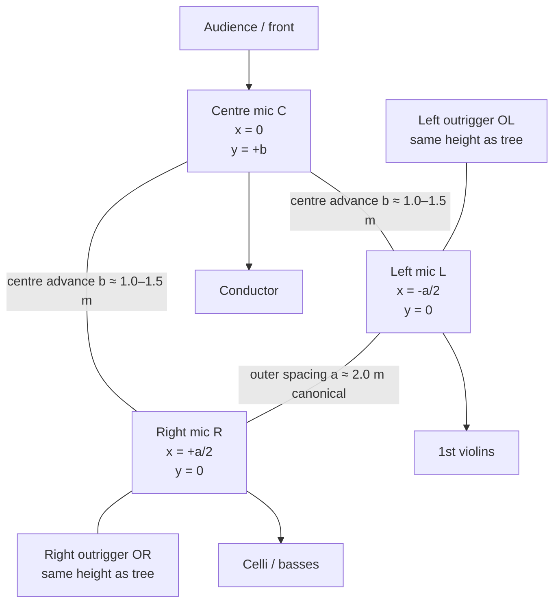
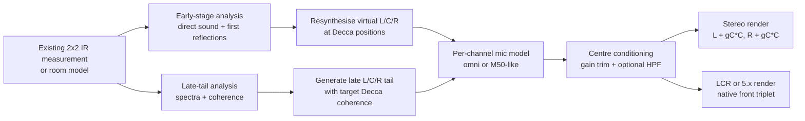

# Decca Tree capture versus two-mic stereo pairs for impulse responses and spatial reverb modelling

## Executive summary

A Decca Tree is not merely “a wide stereo pair plus some centre.” In the classical form documented by Decca-derived practice, it is a **three-microphone front array** in which the left and right microphones are widely spaced, while the centre microphone is **physically forward** of that baseline and then mixed into both output channels with centre attenuation. Historically, the classic published description is roughly **2 m left-to-right** with the centre mic **about 1 to 1.5 m forward**, mounted **about 2.5 to 3.2 m high** above and slightly behind the conductor/front desks, with later practice often adding left/right outriggers for wider orchestras. Early Decca experiments used cardioids; later practice standardised around **Neumann M 50**-type pressure microphones because they combine full low-frequency pickup with useful high-frequency directionality. citeturn7view0turn7view7turn15view0turn11view0turn7view1

For an IR reverb engine, the most important difference from a two-mic pair is that the centre channel is **not derivable by a simple mid calculation**. A true Decca centre is displaced in space, so it captures a different direct arrival time, a different early-reflection pattern, and a different low-frequency modal balance from the left and right microphones. That is why it can fill the “hole in the middle,” stabilise the centre image, and at the same time increase low-frequency weight or boom if overused. Decca-practice sources explicitly note that too much centre reduces depth and width and can make the strings boomy; some engineers high-pass the centre around **110 Hz** to keep low-frequency clarity. citeturn7view0turn16view0

Physically, the Decca Tree operates further into the **time-difference / low-coherence** regime than near-coincident pairs such as ORTF. With a 2 m outer spacing, the left-right time-difference for a source at ±30° is about **2.9 ms** if one models the source as far-field; ORTF’s 17 cm spacing gives only about **0.25 ms** from spacing alone. The result is a much more spacious, enveloping, and decorrelated sound field, but also less stable localisation unless the centre channel is used intelligently. AES literature on spaced arrays makes exactly this trade-off explicit: low inter-channel coherence increases envelopment, while localisation of discrete events becomes less stable unless additional processing or channel design is applied. citeturn26view0turn36view0turn36view1

For code, the best architecture is to treat Decca Tree capture as a **native three-channel latent IR representation** and only render to stereo or LCR at the output stage. If you already have three channels, a robust stereo render is:

\[
\tilde H_{L,s}(f)=H_{L,s}(f)+g_C(f)\,H_{C,s}(f),\qquad
\tilde H_{R,s}(f)=H_{R,s}(f)+g_C(f)\,H_{C,s}(f) ,
\]

with \(g_C(f)\) starting near **0.707** (−3 dB constant-power centre contribution), optionally reduced below about **80 to 120 Hz** to avoid centre-driven LF thickening. If you only have an existing **two-mic / two-speaker** IR set, an exact recovery of a true Decca centre is **underdetermined**; the only rigorous solution is re-measurement or a geometric room model. If re-measurement is impossible, the best approximation is a **hybrid method**: resynthesise the direct sound and early reflections geometrically at the virtual centre position, and synthesise the late tail so that its **pairwise coherence** matches a Decca target rather than simply cloning the mid signal. citeturn16view0turn34view4turn36view0turn23search7

## Canonical geometry, microphones, and rigging

The published “canonical” Decca Tree is less rigid than popular folklore suggests. Official and near-primary descriptions consistently agree on the basic form: **three widely spaced microphones in an inverted T or triangular arrangement**, with the centre microphone forward of the left-right line. DPA’s definition gives approximately **2 m** between left and right, the third microphone about **1 m** forward, mounted roughly **2.5–3 m** high; AEA’s Decca Tree primer gives the same 2 m outer spacing but about **1.5 m** forward for the centre, with array placement a few feet behind and about **8–10 ft** above the conductor. The Decca-tradition text adds that practical orchestral working height is typically **2.74–3.20 m**, with higher placement becoming more ambient than main pickup. citeturn7view7turn7view0turn15view0

Because published measurements differ, the safest implementation choice is to treat “classic Decca” as a **family** centred on:

- outer spacing \(a\): **1.8–2.0 m** as the classical default,
- centre advance \(b\): **1.0–1.5 m**,
- array height \(h\): **2.7–3.2 m** for orchestral main pickup,
- outriggers added when the ensemble is wider than the three-mic triangle can cover cleanly. citeturn7view0turn7view7turn15view0

A useful engineering coordinate system is:

\[
\mathbf r_L = (-a/2,\,0,\,h),\quad
\mathbf r_C = (0,\,b,\,h),\quad
\mathbf r_R = (+a/2,\,0,\,h).
\]

For a five-mic Decca-style orchestral array, the outriggers are usually placed at the **same height** as the main triangle, substantially farther out than the triangle and somewhat farther back relative to the orchestra front. The Decca-tradition excerpt gives a practical starting point of about **3.20–3.35 m** from the centre line for each outrigger, normally **1.42–1.58 m** farther back from the front of the orchestra. citeturn15view0

The top-down geometry below shows the modelling abstraction that is most useful for code:

Historically, the microphones evolved from early **M49/KM56 cardioid** experiments to the **Neumann M 50** and equivalent sphere-mounted pressure microphones. Official Neumann documentation explains why the M 50 became the benchmark: it is effectively **omnidirectional at low frequencies** but becomes **increasingly directional above about 1 kHz**, while retaining strong low-frequency extension without proximity effect. Schoeps’ modern Decca Tree set uses omni capsules with **KA 40 sphere attachments**, specifically to recreate the same principle: more off-axis shadowing and therefore more inter-channel level difference between **1 and 4 kHz**. In other words, the classic Decca Tree is not “purely time-based” in the most important localisation band; its microphone choice deliberately injects some useful HF level cueing. citeturn11view0turn7view1turn11view1

Orientation is therefore a subtle but important issue. DPA’s modular S5 mount notes that when the microphones are **true omnis**, orientation is optional, but AEA recommends pointing the principal axes **inward and downward** because omnis become more directional at higher frequencies, and the Decca-tradition text likewise treats careful aiming as part of making the tree work well. This means your code should expose **orientation** as a real parameter for M50-like or sphere-assisted omnis, even if you collapse it to “no orientation effect” for ideal pressure microphones. citeturn37view0turn7view0turn15view0

Rigging and suspension are not incidental details. The original Decca tree frame used utilitarian slotted metal (“Dexion”) left over from Decca’s tape-store construction, while modern systems use purpose-built modular tree mounts. In practical recording, the microphones are often **suspended from above** or carried on a substantial stand with a **horizontal boom** kept safely behind the podium; the Decca-tradition guidance explicitly warns that ordinary boom stands are not robust enough. DPA’s S5 mount supports multiple Decca and surround layouts and allows **60–210 cm** microphone spacings in T-shape or equilateral configurations. citeturn31search0turn7view6turn7view5

## What the centre mic changes physically and perceptually

A two-mic stereo pair can produce stereo width, but a classical Decca Tree adds a **physically forward centre sensor** that changes the capture problem in three distinct ways: direct-wave timing, centre-image stability, and low-frequency capture. AEA’s Decca primer states the practical outcome plainly: the outer microphones provide the intensity and phase cues that create openness and spaciousness, while the **middle microphone maintains a solid central image**. The Decca-tradition text says the inverse as well: too little centre causes a **hole in the middle**, while too much centre collapses the width and depth. citeturn7view0turn16view0

For a frontal source, the physical centre microphone arrives **earlier** than the outer pair because it is placed forward by \(b\). In the far field, the centre lead for a source on the array axis is approximately:

\[
\Delta \tau_{C,\text{outer}} \approx \frac{b}{c}.
\]

With \(b=1.0\) to \(1.5\) m and \(c\approx343\) m/s, that is roughly **2.9 to 4.4 ms**. This is far larger than the intra-pair timing of most near-coincident two-mic techniques. By contrast, DPA’s ORTF geometry uses **17 cm** spacing, and even a ±30° source produces only about **0.25 ms** of spacing-derived delay. That timing difference is one reason Decca-derived captures feel more “large-scale” and spacious than ORTF/NOS/DIN, but it is also why a synthetic centre cannot be modelled well as a simple amplitude-only mid signal. citeturn26view0turn7view0

A second difference is the inter-channel phase structure. For a plane wave from horizontal azimuth \(\theta\), with \(\theta=0\) on-axis/front and positive \(\theta\) to the right, the standard far-field model is:

\[
X_m(f,\theta) = D_m(f,\theta)\,S(f)\,e^{-j2\pi f \tau_m(\theta)},
\]

\[
\tau_m(\theta) = -\frac{\mathbf u(\theta)\cdot \mathbf r_m}{c},
\qquad \mathbf u(\theta)=[\sin\theta,\cos\theta,0].
\]

So the pairwise delays are:

\[
\Delta\tau_{LR}(\theta)\approx -\frac{a\sin\theta}{c},
\]

\[
\Delta\tau_{LC}(\theta)\approx -\frac{(a/2)\sin\theta+b\cos\theta}{c},
\]

\[
\Delta\tau_{RC}(\theta)\approx \frac{(a/2)\sin\theta-b\cos\theta}{c}.
\]

The corresponding inter-channel phase is:

\[
\phi_{ij}(f,\theta)= -2\pi f\,\Delta\tau_{ij}(\theta)
+ \angle D_i(f,\theta)-\angle D_j(f,\theta).
\]

This matters because Decca is not a single-pair problem; it is a **triangle of pairwise relations** whose phantom image formation changes depending on whether the listener hears L/R, L/C, or C/R dominance. Gernemann’s technical analysis of the Decca Tree explicitly argues that the microphones must be spaced far enough apart that meaningful time and level differences occur between them; otherwise the multiple phantom-source relationships blur into one diffuse, colourised image through interference. citeturn34view4turn9view0turn26view0

Low-frequency behaviour is the third major difference. Neumann’s archive-based M 50 documentation says the microphone is a true pressure transducer with **powerful bass response down to subsonic frequencies** and no proximity effect. That is part of the famous Decca warmth, but it is also why the centre mic can over-thicken the image. The Decca-tradition text specifically warns that if the centre level is too high, width and depth reduce and the low end can become **boomy**; it even recommends a centre-channel **high-pass around 110 Hz** as one practical way to preserve the image benefit while leaving LF to the outer microphones. citeturn11view0turn16view0

This observation is directly relevant to IR reverb design. If your current two-mic model stores only \(L\) and \(R\), and you create \(C\) by \(C=(L+R)/2\), you will produce a centre that is **too correlated**, usually **too late** for frontal direct sound, and often **too similar in LF modal structure** to the side channels. A true Decca centre is instead a third room probe with its own transfer function. In code terms, the centre channel is a **new measurement operator**, not just a new mix coefficient. That conclusion follows from the physical displacement and from AES work showing that spaced arrays owe their envelopment to lower inter-channel coherence, whereas coincident/matrix methods provide more stable localisation. citeturn7view0turn16view0turn36view0

## Mathematical models and synthesis of three-channel IRs

For implementation, the cleanest formalism is to represent the IR system as a source-to-microphone matrix:

\[
\mathbf H(f)=
\begin{bmatrix}
H_{L,s_1}(f) & H_{L,s_2}(f)\\
H_{C,s_1}(f) & H_{C,s_2}(f)\\
H_{R,s_1}(f) & H_{R,s_2}(f)
\end{bmatrix},
\]

where \(s_1,s_2\) are your two excitation loudspeakers and \(L,C,R\) are the Decca microphones. If your engine remains stereo-out, the correct place to reduce dimensionality is the **render stage**, not the capture stage. A constant-power Decca-style stereo render is:

\[
\tilde H_{L,s}(f)=H_{L,s}(f)+g_C(f)\,H_{C,s}(f),
\qquad
\tilde H_{R,s}(f)=H_{R,s}(f)+g_C(f)\,H_{C,s}(f),
\]

with \(g_C(f)\approx 0.707\) at mid/high frequencies as the Decca-style centre contribution to phantom centre. This is consistent with both practical Decca panning guidance and the technical description that the centre signal is sent equally to left and right with the normal **3 dB centre attenuation** of a pan law. citeturn16view0turn35view1

The most useful additional refinement is a frequency-dependent centre weight:

\[
g_C(f)=g_{C,\text{mid/high}}\cdot G_{\text{HP}}(f),
\]

where \(G_{\text{HP}}(f)\) is either a gentle shelving reduction or a genuine high-pass if you want Decca-style LF cleanup. A practical starting point is:

- \(g_{C,\text{mid/high}} = 0.65\) to \(0.80\) linear,
- \(f_{HP,C} = 80\) to \(120\) Hz,
- default \(f_{HP,C}=110\) Hz if the source material or room already has generous LF energy.

Those numeric defaults are engineering proposals rather than historical absolutes, but they follow directly from documented Decca practice: equalised centre feed with effective −3 dB pan depth, plus the explicit recommendation of HPF around 110 Hz on the centre to preserve LF clarity. citeturn16view0turn35view1

For coherence modelling, the late reverberant field should not be treated like the direct sound. For a diffuse field and omnidirectional sensors separated by distance \(d_{ij}\), the standard target coherence is often approximated by:

\[
\Gamma_{ij}(f)\approx \operatorname{sinc}\!\left(\frac{2\pi f d_{ij}}{c}\right).
\]

Schoeps’ advice that the Decca microphones should be placed **at least 1.5 m apart** specifically to reduce crosstalk and excessive LF correlation, together with Wittek’s emphasis on low diffuse-field correlation for spacious reverb and AES results on spaced arrays, all support using a low-coherence target for the **late tail**. citeturn7view1turn23search7turn36view0

For a canonical Decca geometry:

\[
d_{LR}=a,
\qquad
d_{LC}=d_{RC}=\sqrt{(a/2)^2+b^2}.
\]

With \(a=2.0\) m and \(b=1.2\) m, one gets \(d_{LC}=d_{RC}\approx1.56\) m. In the diffuse-field sinc model, the first zero of \(\Gamma_{LR}\) is then at approximately \(c/(2a)\approx 86\) Hz, and the first zero of \(\Gamma_{LC}\) at about \(c/(2\times1.56)\approx 110\) Hz. By comparison, ORTF’s 17 cm spacing pushes the first zero to about **1 kHz**, so its channels stay far more correlated across the low and low-mid band. This is one concise way to quantify why a Decca Tree yields a larger, less pin-sharp, more enveloping reverb field than ORTF or XY. citeturn26view0turn7view1turn36view0

In code, this points to a two-stage IR model.

First, treat the **direct sound and early reflections** as deterministic:

\[
h_m^{\text{early}}(t)=\sum_k a_{m,k}\,\delta(t-\tau_{m,k}),
\]

with \(a_{m,k}\) derived from inverse distance, source directivity, microphone directivity, and absorption along the path, while \(\tau_{m,k}\) is computed at the actual Decca mic positions. This is the part where the forward centre position matters most. If you know speaker positions and room/image-source geometry, this stage should be fully geometric. citeturn34view4turn36view0

Second, treat the **late tail** statistically or parametrically:

\[
\mathbf H^{\text{late}}(f,n)\sim \mathcal N_{\mathbb C}\!\left(0,\mathbf \Sigma(f)\right),
\quad
\mathbf \Sigma(f)=\mathbf P^{1/2}(f)\,\mathbf \Gamma(f)\,\mathbf P^{1/2}(f),
\]

where \(\mathbf P(f)\) is the per-channel late-tail power spectral density and \(\mathbf \Gamma(f)\) is the target coherence matrix from the chosen Decca geometry. This is conceptually very close to what AES parametric spatial-audio work does when it separates directional and diffuse content so that spaced-array spaciousness can be preserved while localisation becomes more stable. citeturn36view0turn36view1

If you do **not** have a true three-channel measurement, the best approximation from an existing two-mic IR is a hybrid strategy:

1. **Direct sound and first reflections**: estimate arrival times and angles from the existing pair by cross-correlation or GCC-PHAT, then resynthesise those events at the virtual Decca positions using the geometric equations above.  
2. **Mid-tail and late tail**: do **not** set \(C=(L+R)/2\) full-band. Instead, derive a centre-biased late component from the pair’s mid signal and then inject controlled decorrelation so that \(\Gamma_{LC}(f)\) and \(\Gamma_{RC}(f)\) approach your Decca targets.  
3. **Stereo render**: add the synthetic centre to \(L\) and \(R\) using the Decca weighting above, optionally with LF reduction in the centre feed. citeturn16view0turn36view0

A practical signal flow for that architecture is:

## Variant families and parameter ranges

The Decca Tree today is better understood as a **design family** than a single fixed rig. That is already visible in official products and technical literature: DPA’s S5 mount supports classic T-shape, equilateral arrangements, and multiple surround arrays; Schoeps treats the Decca Tree as one solution among several surround/immersive front-array strategies; the Decca-tradition text explicitly says the tree has existed in different forms across decades and was always open to experimentation. citeturn7view5turn7view1turn31search0

The following comparison table is compiled from official DPA stereo-technique documentation for two-mic pairs, plus AEA, DPA, Schoeps, Neumann, and the Decca-tradition text for Decca geometry and microphone behaviour. citeturn28view0turn27view3turn27view0turn7view0turn7view7turn15view0turn11view0

| Technique | Channels | Typical spacing | Typical angle | Typical polar pattern | Height as main pickup | Stereo width | Localisation | Ambience / envelopment | Mono behaviour |
|---|---:|---:|---:|---|---|---|---|---|---|
| XY | 2 | Coincident / near-zero | 90° common | Cardioid or figure-8 | Source-dependent, not intrinsic | Moderate | Stable | Lower than AB/Decca | Strong; no AB-style combing on mono sum citeturn27view3 |
| Blumlein | 2 | Coincident / near-zero | 90° | Figure-8 | Source-dependent | Moderate frontal width, strong room pickup | Good frontal, rear/side phase behaviour can be complex | Rich ambience | Good coincident compatibility, but rear image folds forward in stereo playback citeturn27view2turn27view3 |
| AB spaced omni | 2 | Variable; 40 cm shown as example for ±70° recording angle | 0° | Omni | Source-dependent | Wide | Less precise than XY/ORTF | Pleasant reverberant field, strong LF | Poorer mono sum; comb filtering risk citeturn28view0 |
| ORTF | 2 | 17 cm | 110° | Cardioid | Source-dependent | Wider than XY | Good | Good ambience with decent precision | Reasonable mono information citeturn26view0 |
| DIN | 2 | 20 cm | 90° | Cardioid | Source-dependent | Moderate/wide | Good | Moderate | Better than AB, less spacious than Decca citeturn26view0 |
| NOS | 2 | 30 cm | 90° | Cardioid | Source-dependent | Wide | Good but less tight than ORTF | More spacious than ORTF | More phase-sensitive than ORTF citeturn26view0 |
| Classical Decca Tree | 3 | L–R ≈ 2 m, C forward ≈ 1.0–1.5 m | Outer mics aimed to sections; true omnis can ignore rotation, M50-like omnis should not | Historically cardioids first, then M50-style omnis | About 2.74–3.20 m over orchestra | Very wide, scalable | Stronger centre than AB due to real C mic, but still less point-stable than coincident techniques | High envelopment, strong LF, lush hall image | Do not treat as a casual mono-sum technique; centre management matters citeturn7view0turn7view7turn15view0turn11view0turn7view1 |

For Decca-family variants, the most useful implementation view is to classify them by **what problem they are trying to solve** rather than by brand name. The table below focuses on parameters that matter in code. Values are either explicit from the cited sources or, where the literature reviewed does not provide a single canonical dimension, given as design ranges inferred from those families and marked as such. citeturn13view0turn13view1turn13view2turn12view1turn7view5turn31search0turn6search5turn35view3

| Variant family | Core idea | Useful parameter range for modelling | What it buys you |
|---|---|---|---|
| Classic stereo Decca Tree | 3-mic front triangle; physical centre fill | \(a\approx1.8–2.0\) m, \(b\approx1.0–1.5\) m, \(h\approx2.7–3.2\) m | Large image, strong hall, solid centre when C is correctly weighted citeturn7view0turn7view7turn15view0 |
| Wide Tree | Increase \(a\), often with outriggers | \(a\) increased beyond classical baseline; outriggers added when ensemble width exceeds triangle coverage | More edge detail and larger image, but greater risk of centre hole / unstable localisation if C is underweighted citeturn7view0turn15view0 |
| Mini-Decca / chamber tree | Same topology, smaller scale | Practical modern mounts allow 60–210 cm spacing; chamber use tends toward the lower end of that range | Keeps Decca weighting/forward-centre behaviour in smaller rooms or on chamber groups citeturn7view5turn15view0 |
| Centre-hybrid Decca | Replace single C mic with coincident stereo element | Keep spaced outer Decca L/R; centre becomes MS, XY, or similar | Stronger and more controllable centre articulation; more complex phase/crosstalk management citeturn6search5turn35view3 |
| Omni-based 5.x Decca-style surround | Front triplet as Decca Tree, rear pair added | Front L–R **60–120 cm**, L–C and R–C **30–60 cm**, C ahead **15–45 cm**, front–rear **2–5 m**, rear pair **2–3 m** | Strong tonal balance and envelopment with rear immersion; less isolation between channels citeturn13view0 |
| WCSA | Wide-cardioid alternative to omni Decca-style surround | L–C and R–C **60–75 cm**, C ahead **20 cm**, front–rear **150–200 cm**, LS–RS **120–150 cm**, L/R at **±15°**, LS/RS at **±165°** | More ambience control and better front localisation than omni-only spacing, while keeping spaciousness citeturn13view1turn12view4 |
| OCT / OCT2 | Cardioid/supercardioid front triplet with minimal forward centre | L/R spacing **40–90 cm**, centre only **8 cm** ahead in OCT; **40 cm** ahead in OCT2 | Higher separation and localisation stability; OCT2 adds Decca-like spaciousness via greater C advance citeturn13view2turn9view0 |
| Fukada Tree | Cardioid Decca-family surround + omni outriggers | Exact dimensions not uniquely specified in the sources reviewed; front section is Decca-like and rear cardioids face backward; omni outriggers restore tone/LF | Improved channel separation with cardioids, while omnis restore natural colour and LF pickup citeturn12view1 |
| Historical six-mic Decca opera tree | Archival Decca variant used 1967–1972 | Existence documented, but no single accessible published geometry emerged in the reviewed sources | Important historically; treat as a separate archival subtype rather than a universal modern standard citeturn31search0turn31search1 |

A final point on “Decca 5/6”: in modern engineering language, what many people mean by “Decca 5” is simply a **Decca-style front triplet plus two rear/surround microphones** for 5-channel or 5.x work. The DPA omni-based surround array and Williams’ MMAD front-triplet/rear-pair designs are the most implementation-friendly references in the sources reviewed. A historically distinct **six-microphone Decca tree** also existed in Decca opera work from about 1967 to 1972, but the reviewed accessible sources document the fact of the array more clearly than they publish a single canonical geometry for it. citeturn13view0turn31search0turn31search1

## Recommended implementation defaults

Because your room dimensions, speaker layout, and existing IR-measurement geometry are unspecified, the defaults below are presented as **engineering starting points**, not historical absolutes. They are chosen to preserve what the cited sources identify as the essential Decca properties: physical forward centre, reduced diffuse-field correlation, and careful centre weighting to avoid LF thickening. citeturn16view0turn36view0turn7view1

### Native three-channel capture model

If you can extend the measurement or room simulation itself, use an internal **3-mic latent representation**:

\[
\mathbf H(f)=\{H_L(f),H_C(f),H_R(f)\}
\]

with default geometry:

- \(a = 2.0\) m,
- \(b = 1.2\) m,
- \(h = 3.0\) m,
- mic type switch:
  - **Ideal omni**: \(D(f,\theta)=1\),
  - **M50-like omni**: omni below ~1 kHz, then gradual HF directivity and presence rise above ~1 kHz, especially in the **1–4 kHz** region. citeturn11view0turn11view1

A practical M50-like directivity approximation for code is a morph from omni to wide-cardioid-ish behaviour:

\[
D_{\text{M50-like}}(f,\theta)=
(1-w(f))\cdot1 + w(f)\cdot(\alpha+(1-\alpha)\cos\theta),
\]

with \(\alpha\approx0.7\) and \(w(f)\) ramping from 0 near **1 kHz** to 1 by **4 kHz**, plus an on-axis shelf of roughly **+3 to +5 dB** by the upper presence band. That is not a claim of exact M50 physics; it is an implementation proxy grounded in Neumann’s and Schoeps’ documented statements that the M50/KA40 principle adds HF directivity and reach while leaving LF behaviour omni-like. citeturn11view0turn11view1

### Stereo render from internal Decca channels

For two-channel output, start with:

\[
Y_L = H_L + g_C\,H_C,\qquad
Y_R = H_R + g_C\,H_C,
\]

where \(g_C = 0.707\) by default, with a user-adjustable range of **0.60–0.85**.

Then apply one of these centre-conditioning options:

- **Pure Decca-stereo render**: full-band \(g_C\), if the room is not LF-heavy.
- **Clarity-preserving render**: HPF on centre at **110 Hz**.
- **Adaptive render**: shelf the centre contribution down by **1–3 dB below 120 Hz** rather than using a hard HPF. citeturn16view0turn35view1

A compact M/S implementation is also useful because it keeps user-facing width control simple:

\[
M_o=\frac{H_L+H_R}{\sqrt2},\qquad S_o=\frac{H_L-H_R}{\sqrt2},
\]

\[
M' = M_o + g_C H_C,\qquad S' = w\,S_o,
\]

\[
Y_L=\frac{M'+S'}{\sqrt2},\qquad Y_R=\frac{M'-S'}{\sqrt2}.
\]

Here \(w\) is a width factor, with **0.9–1.1** as a conservative range. This keeps the Decca centre contribution on the mid axis, which is perceptually where it belongs. The supporting rationale comes from the documented role of the centre mic as centre fill and from the observation that level panning is generally more robust than time-only panning for phantom images. citeturn16view0turn22view0

### Early/late split and decorrelation

If you are deriving Decca from an existing two-mic IR, split the IR around **50–80 ms**. Use the earlier segment for deterministic geometry-driven resynthesis and the later part for target-coherence synthesis. The exact split should follow the venue and the source distance, but the principle is stable across the literature: directional localisation cues and discrete events benefit from stable treatment, while a spaced-array’s appealing spaciousness comes from lower-coherence reverberant content. citeturn36view0turn36view1

For the late tail, target the pairwise coherence matrix rather than arbitrary “stereo widening.” If you need a lightweight implementation, a good approximation is:

- derive a late-tail mid estimate \(M_{\text{late}}\),
- create \(C_{\text{late}}\) from \(M_{\text{late}}\) plus a decorrelated component,
- shape that decorrelated component so measured \(\gamma_{LC}(f)\) and \(\gamma_{RC}(f)\) approach the Decca targets.

In practice, that can be done with short decorrelators or STFT-domain mixing. A sensible starting point is to keep decorrelation **minimal below about 150 Hz**, moderate it through the low midrange, and allow more decorrelation above a few hundred hertz, consistent with the documented role of lower diffuse-field correlation in producing spaciousness. citeturn23search7turn36view0

### If you only have an existing two-mic IR

Where re-measuring is impossible, a serviceable approximation is:

\[
\hat H_C^{\text{early}}(t)
= \text{ResynthesiseAt}(\mathbf r_C;\ \hat{\tau}_k,\hat{a}_k,\hat{\theta}_k),
\]

\[
\hat H_C^{\text{late}}(f)
= \beta(f)\,M_{\text{late}}(f) + \eta(f),
\]

where \(\eta(f)\) is decorrelated and shaped to satisfy target pairwise coherence, and \(\beta(f)\) is a modest spectral weighting, usually near unity through the mids and slightly reduced in LF if the result gets too dense. Then render to stereo using the Decca centre rules above.

The important warning is that this is an **approximation**, not a recovery. Because the real centre microphone is spatially displaced, and because spaced arrays derive their spaciousness from genuinely different time and correlation cues across channels, a faithful Decca centre cannot be inferred exactly from a two-channel capture without extra geometry or modelling assumptions. That is a conclusion from the physics of the array and from the cited AES literature on spaced arrays and directional analysis. citeturn7view0turn36view0turn36view1

## Assumptions and follow-up questions

The recommendations above assume a conventional front-stage source field, stereo playback with the standard loudspeaker arrangement discussed in DPA’s stereo guide, \(c\approx343\) m/s, and no exact prior knowledge of your room or speaker geometry. They also assume you want to preserve a **Decca-like capture aesthetic** rather than emulate every historical Decca session practice. Where the reviewed sources did not expose one universally accepted number — especially for some historical six-mic and hybrid variants — I have treated the design as a parameter family and said so explicitly. citeturn26view0turn31search0turn31search1

To finalise an implementation, these are the questions that matter most:

- What are your current **speaker positions** during IR measurement: angle, spacing, and height?
- Are your existing IRs true **2×2 source-to-mic matrices**, or are they already folded into stereo returns?
- Can you **re-measure** with a third mic, or must the centre be synthesised from existing data?
- Is the runtime target **stereo only**, or do you also want native **LCR / 5.x / Atmos-derived** outputs?
- Do you want the virtual microphones to behave like **ideal omnis**, **M50-like sphere omnis**, or some other directivity family?
- Are you willing to split the IR into **deterministic early** and **statistical late** parts?
- How important is **mono fold-down** for your product?
- Is the desired result “cinematic Decca warmth” or “analytical front-stage precision”? Those two targets imply different centre LF management and different late-tail coherence.
- Do you want your “Decca Tree” mode to model a **three-mic stereo tree**, a **five-mic orchestral tree with outriggers**, or a **5.x front-triplet plus rear-pair** surround family?
- What are the approximate **room dimensions** and reverberation time of the spaces from which your current IRs were captured? Without that, any synthetic centre tail remains only a statistical best fit.